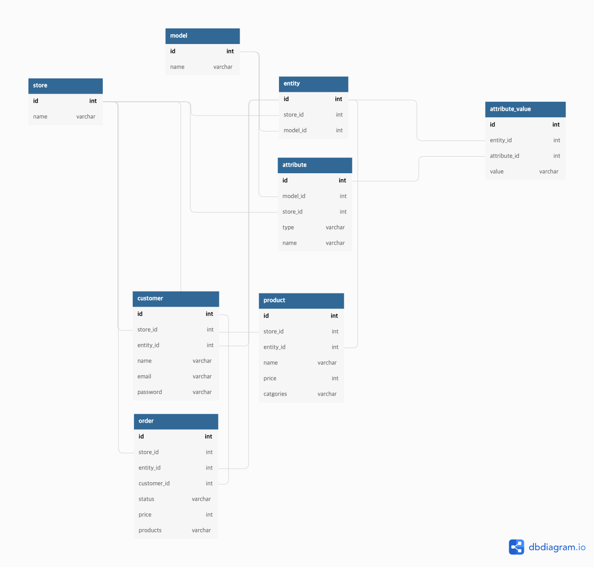

## Stack
- nodejs
- nestjs
- mysql
- liquibase
- docker
- swagger

## Installation
1. 도커 이미지 실행
```bash
$ yarn docker:up
```

2. 서비스 실행
- 실행 후 docker에 모든 자원은 실행되었지만 liquibase를 통해 모든 스키마 및 mocking 데이터가 생성되므로 1분 ~ 2분 정도 더 기다리신 후 확인하실 수 있습니다.
```bash
$ yarn service:up
```

3. 서비스 종료
```bash
$ yarn service:down
```

## Documentation
- host: localhost
- port: 3000
- docs: /api

## 상세 설명
사용자 정의 필드를 개발하기 위해 EAV 패턴을 활용하였습니다.

- EAV 패턴에서 Attribute에 속성 필드를 추가하여 다양한 UI를 적용할 수 있도록 하였습니다.
- EAV 패턴에서 model 개념을 추가하여 동적으로 도메인을 관리할 수 있도록 적용하였습니다.
ex) 현재는 주문, 사용자, 상품에만 적용되지만 추후 사양 변경으로 인해 다른 도메인 또한 사용자 정의 필드가 필요하다면 model 테이블을 활용하여 유연하게 처리할 수 있습니다.

## ERD

